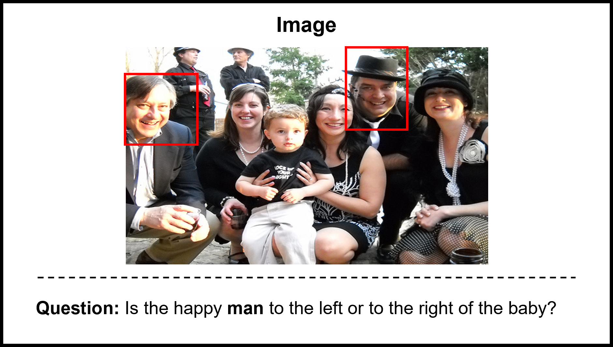

# LBA-Q2Q

- A new data set for GQA which aims at generating an intermediate question from an ambiguous question.
- The major differences of Q2Q from previous data sets are two folds.  
  - One is that the intermediate questions in Q2Q are generated to clarify questions, not to disambiguate them.
  - Every intermediate question should be made by understanding the supplementary image of an ambiguous question.
- Ambiguous Question
  - a question of which entities appear multiple times in its visual context.


## Ambigous Question Sample



## Acknowledgement
```
This work was partly supported by Institute of Information & communications Technology Planning & Evaluation (IITP) grant funded by the Korea government(MSIT)
(No.RS-2022-00155911, Artificial Intelligence Convergence Innovation Human Resources Development (Kyung Hee University))
and  (No. 2022-0-00951, Development of Uncertainty-Aware Agents Learning by Asking Questions)
```